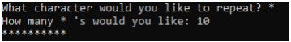

## Recursion - String of Characters

### Instructions:
 
- Create a function that uses recursion to generate and return a string of repeating characters. The function should take two parameters. One of the two parameters should be the character that is to be repeated. The second parameter should be the number of times the character should be repeated. 
  - Hint: do not print the characters in the function 
- Enter your name, the lab number, and the current date into a set of comments at the top of the code.	
- Push the program source code to the assignment repo. 

### Example Output

### Grading:
General, compiles, comments, proper indentation, etc  
Passing and returning data  
Logic to recursively generate and return a string of repeating characters 
